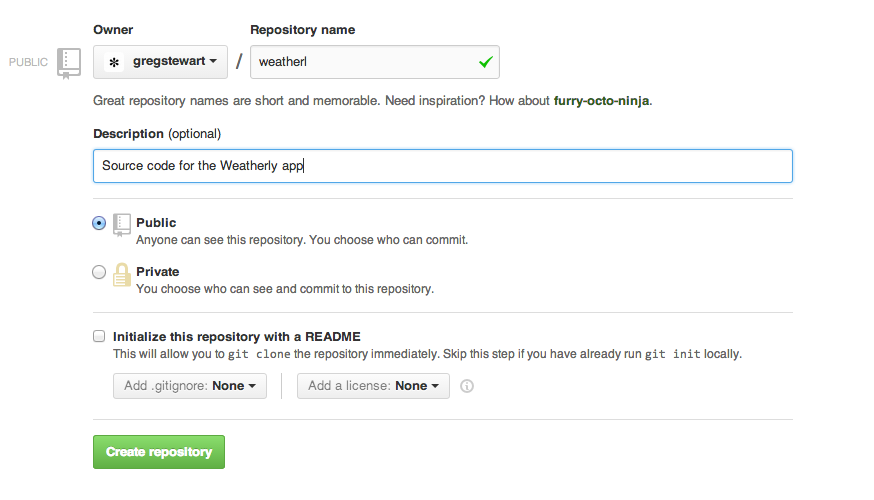

#Book outline#

## Introduction ##
The idea for this book started with a series of blog posts I wrote some time ago exploring building a [Backbone.js](http://backbonejs.org/) app using tests. I initially wanted to consolidate these blog posts into a book, but upon reflection decided to expand the scope.

### What we will be building ###
As you go through this book, we'll be builing a small JavaScript weather app using [forecast.io](http://forecast.io) API. The app itself will use the browser's Geolocation API to figure out where your user is and retrieve a weekly weather forecast for that location.

### How we will build it ###
Plain and simple, we'll build this app guided by tests using a continuous delivery model, by having it deployed using [Codeship's CD service](https://www.codeship.io/) to a [Heroku](https://www.heroku.com/) instance. 

The focus of this book is really about setting you on the right path to delivering quality software reliably and continuously. By the end you should have the confidence to push every commit to 'production'.

We will be making extensive use of the following tools:
* Node.js
* Grunt
* Yo
* Karma
* Jasmine
* Cucumber
* Selenium
 
  
### What you will need ###
There are few pre-requisits you will need to get this app built.
#### Services you wil need to sign up for ####
As I mentioned for our weather forecast API, we'll be using [forecast.io](https://developer.forecast.io/), so you might want to [go and sign up for a developer account](https://developer.forecast.io/register) as you will need a key to access the API.

So that we can reliably deploy our app, we'll make use of [Codeship's](https://www.codeship.io/) hosted CD service. Sign up for the [free service] (https://www.codeship.io/pricing) to get started.

To host our app we'll make use of [Heroku](https://www.heroku.com/) cloud computing service. They also [offer a free service](https://www.heroku.com/pricing) to help you get started.

You should also sign up for a [Github](https://github.com/) or [Bitbucket](https://bitbucket.org/) account if you don't already have one, we'll need this for our CD service.

That should cover the things you need to sign up for.

####Code editor####
You will need a decent IDE (I recommend [WebStorm](http://www.jetbrains.com/webstorm/)) or Text Editor ([Sublime](http://www.sublimetext.com/) is very popular with colleagues)

#### Version control: Git ####
I recommend using Version Control for every project, regardless of size or complexity. If don't already have [Git](http://git-scm.com/) installed you should do so. There are many ways to install the necessary binaries and the [Git website has all the necessary links](http://git-scm.com/downloads). If you are on a Mac though, then I would recommend using [Homebrew](http://brew.sh/) to install the binaries.

If you are new to Git then I recommend taking the [Git Immersion guided tour](http://gitimmersion.com/).

#### Node.js and NPM ####
We'll be making extensive use of JavaScript throughout the book, so you will need to install [Node.js and NPM](http://nodejs.org/). Once again if you are on a Mac though, then I would recommend using [Homebrew](http://brew.sh/) to install the binaries.

NPM will allow us to resolve all of the dependencies we need in order to achieve our goal of building and delivering a web app guided by tests. 

#### Bower ####
[Bower](http://bower.io/) is handy tool to manage your front end library dependencies, so I recommed installing it as well. 

#### Grunt ####
[Grunt](http://gruntjs.com/) 

With that it's time to get started!

## Getting started ##
The first thing I like to do with any project is to get our build pipeline set up and start deploying code to our 'production' environment. To that end we need to look at building the simplest thing possible to validate our testing infrastructure works, our CI envinronment can pick up changes on commit and after a succesful build deploy the changes.

I will assume you have signed up and installed all of the software outlined in the [What you will need section]("What you will need section").

### Setting up our project ###
Open up a terminal window or code to the command line and navigate to the location you want to store your project files. Once there let's create a project folder:

	mkdir weatherly && cd weatherly

And initilise our github repository:

	git init
	Initialized empty Git repository in /Users/gregstewart/Projects/github/weatherly/.git/

Before we go any further let's create a .gitignore file in the root of our project and add the following to it:

	node_modules
	.idea

Let's commit this change quickly: 
	
	git add .gitignore
	git commit -m "Adding folders to the ignore list"

From a folder perspective I like to create a distribution folder and an app folder to hold the source, so let's go ahead and add these folders as well.
	
	mkdir app
	mkdir dist

We'll start by using bower to grab some of our front end dependencies. Let's start by creating a bower.json file by typing: `bower init`, fill in the details as you see fit, but here's what I selected:

	{
  		name: 'weatherly',
  		version: '0.0.0',
  		authors: [
    		'Greg Stewart <gregs@tcias.co.uk>'
  		],
  		description: 'Building a web app guided by tests',
  		moduleType: [
    		'amd'
  		],
  		license: 'MIT',
  		homepage: 'http://www.tcias.co.uk/',
  		private: true,
  		ignore: [
    		'**/.*',
    		'node_modules',
    		'bower_components',
    		'test',
    		'tests'
  		]
	}	

Everybody likes a bit of Bootstrap so let's start with that package (I use the SASS port and quite frankly so should you):

	bower install bootstrap-sass-official --save

The `--save` flag at the end of the command means that the dependecy will be added to our bower.jon file. We are doing this because we do not want to check in any external dependencies into our repository. Instead at build/CI time we'll restore these using bower.

So let's edit our .gitignore file to make sure we don't accidentally commit these files:

	node_modules
	.idea
	bower_components

And let's add this change to our repo:

	git add .gitignore 
	git commit -m "Adding bower_components to the ignore list"

Modernizr is another staple:

	bower install modernizr --save

To round things off let's install HTML5 boilerplate

	bower install html5-boilerplate
	
You may have noticed that I decided not to add this package to our bower.json file, simply because we'll copy the files we need into our app folder:

	mv bower_components/html5-boilerplate/css app/
	mv bower_components/html5-boilerplate/img app/
	mv bower_components/html5-boilerplate/*.html app/
	mv bower_components/html5-boilerplate/*.png app/ 
	mv bower_components/html5-boilerplate/*.xml app/
	mv bower_components/html5-boilerplate/*.ico app/
	mv bower_components/html5-boilerplate/*.txt app/

In your favourite editor open up the app/index.html file and add the following:

	<!DOCTYPE html>
	<!--[if lt IE 7]>      <html class="no-js lt-ie9 lt-ie8 lt-ie7"> <![endif]-->
	<!--[if IE 7]>         <html class="no-js lt-ie9 lt-ie8"> <![endif]-->
	<!--[if IE 8]>         <html class="no-js lt-ie9"> <![endif]-->
	<!--[if gt IE 8]><!--> <html class="no-js"> <!--<![endif]-->
    	<head>
        	<meta charset="utf-8">
        	<meta http-equiv="X-UA-Compatible" content="IE=edge">
        	<title>Weatherly - Forecast for London</title>
        	<meta name="description" content="">
    	    <meta name="viewport" content="width=device-width, initial-scale=1">

	        <!-- Place favicon.ico and apple-touch-icon.png in the root directory -->

        	<link rel="stylesheet" href="css/main.css">
    	</head>
    	<body>
        	<!--[if lt IE 7]>
            	
You are using an <strong>outdated</strong> browser. Please <a href="http://browsehappy.com/">upgrade your browser</a> to improve your experience.

        	<![endif]-->

        	<!-- Add your site or application content here -->
        	

            	

                	<ul class="nav nav-pills pull-right">
                    	<li class="active"><a href="#">Home</a></li>
                    	<li><a href="#">About</a></li>
                   		<li><a href="#">Contact</a></li>
                	</ul>
                	<h3 class="text-muted">test</h3>
            	

            	

                	<h1>London Right Now</h1>
                	
Weather Icon 14 degrees

                	
Mostly cloudy - feels like 14 degrees

            	

            	

                	

                    	<h4>NEXT HOUR</h4>
                    	
Mostly cloudy for the hour.

                    	<h4>NEXT 24 HOURS</h4>
                   		
Mostly cloudy until tomorrow afternoon.

                	

            	

            	

                	
 from Weatherly

            	

        	

        	

        	
        	

        	<!-- Google Analytics: change UA-XXXXX-X to be your site's ID. -->
        	
    	</body>
	</html>

If you open up the file in your browser you should see something like this hopefully:

Not exactly something to write home about, but it's enough for us to get started setting up our little server, writing a functional test and deploying something to our Heroku instance.

We'll make this a lot prettier later on in the book when we deal with setting up Grunt to build our JavaScript and CSS assets.

The last thing we'll do is commit all of our changes to our local repos:

	git add .
	git commit -m "Added Bootstrap/Modernizr to bower.json, moved the skeleton of the HTML5 boilerplate to the app folder and created a base index page for our weather forecat app."

At this stage it's a good idea to also push the changes to our remote repository. If you have followed the [What you will need section]("What you will need section"), you will hopefully have created a Github account. If not go ahead and to that now. Then create a repository called weatherly, here's what I entered:

To push our changes to the remote repository, you will need to tell your local repo where it is:

	git remote add origin https://github.com/<account_name>/weatherly.git

Now you can push your changes:

	git push -u origin master
	
###Recap###
Before we move on let's just quickly recap what we have done so far:

* created our app folder structure
* initialised our git repo
* created a Git ignore file
* used bower to manage some of our front end dependencies:
	* Bootstrap
	* Modernizr
	* HTML5 boilerplate
* created a very basic index.html page
* pushed all of the changes to our remote git repository

## Writing our first functional test ##
I order to write our first functional test we needed a test page, which we built in the previous section. Now let's set up a simple Node.js webserver.

### Web server ###
A good practice to follow while working with Git is to create a branch for each feature that you are working on. 
	
	git checkout -b web-server
	
Make sure you are in the root of our project and not in the `app/` folder

Since we'll be using Node.js we can use NPM to manage the dependencies. These dependencies are stored in a folder called node_modules. Since we don't want to check any node modules/packages into our repository we added that folder to our `.gitignore` file in when we set up the project. If we don't add those packages to our repository you may be wondering how our CI and Heroku instance will now how to run the app. To that end we'll use a handy file called `package.json`. When we run NPM we can not only install dependencies, we can also add them to our `package.json` file and our target envinronments can read this file and install these packages for us.

Typing `npm init` give us a way to create our package.json, here's what I answered when prompted:

	This utility will walk you through creating a package.json file.
	It only covers the most common items, and tries to guess sane defaults.

	See `npm help json` for definitive documentation on these fields
	and exactly what they do.

	Use `npm install <pkg> --save` afterwards to install a package and
	save it as a dependency in the package.json file.

	Press ^C at any time to quit.
	name: (weatherly) 
	version: (0.0.0) 
	description: Building a web app guided by tests
	entry point: (index.js) 
	test command: grunt test
	git repository: (https://github.com/gregstewart/weatherly.git) 
	keywords: 
	author: Greg Stewart
	license: (ISC) MIT
	About to write to /Users/gregstewart/Projects/github/weatherly/package.json:

	{
  		"name": "weatherly",
  		"version": "0.0.0",
  		"description": "Building a web app guided by tests",
  		"main": "index.js",
  		"scripts": {
    		"test": "grunt test"
  		},
  		"repository": {
    		"type": "git",
    		"url": "https://github.com/gregstewart/weatherly.git"
  		},
  		"author": "Greg Stewart",
  		"license": "MIT",
  		"bugs": {
    		"url": "https://github.com/gregstewart/weatherly/issues"
  		},
	  	"homepage": "https://github.com/gregstewart/weatherly"
	}
	
	Is this ok? (yes) yes

As you can see it autocompleted a bunch of information for you, such as the project name, version number and Git details. Let's add that file to our repo before going any further:

	git add package.json
	git commit -m "Created package.json file"

Now let's go ahead and install a web server module. We could use [express](http://expressjs.com/), but our purposes it's overkill, so we'll just use [connect](http://www.senchalabs.org/connect/).

	npm install connect --save
	
By specifying `--save` the dependecy was added to our `package.json` file, if you open it up you should see the following toward the end of the file:

	"dependencies": {
   		"connect": "^2.19.6"
  	}

Next create a new file called `server.js` in the root of our project and add the following content:

	var connect = require('connect');
	connect().use(connect.static(__dirname)).listen(3000);

And to start our server type:

	node server.js

If you now open your browser and hit `http://localhost:3000/app/index.html` you should once again see: 

The process that runs our server is not daemonised and will continue to run until we close the console or type `^C`. Go ahead and kill the server and add those changes to our repository, merge these changes back into master and finally push to origin:

	git add server.js
	git add package.json
	git commit -m "Installed Connect and created a very basic web server for our app"
	git checkout master
	git merge web-server
	git push

### Cucumber and Selenium ###

### Our first test ###

cucumber, selenium, web server

###setting up our ci environment using codeship###
 * deploy to heroku
* Tdd
 * setting up our unit tests with karma
   * code coverage
 * continuously run unit tests with grunt
 * add them to our deployment process
 * writing our first unit test
 * integration test
 * using stubs
 * using mocks

* other
 * isomorphic apps
 * react for template rendering
 * bake in performance testing

#TODO#
Netx steps:
Delete css/normalize.css and main.css
Add main.scss and add the following line:
	@import '../../bower_components/bootstrap-sass-official/vendor/assets/stylesheets/bootstrap.scss';
Delete js folder
Some web server

Grunt task to generate css from sass
Grunt copy assets to dist/
Serve content from dist folder
Edit the index.html file

## Appendices ##
