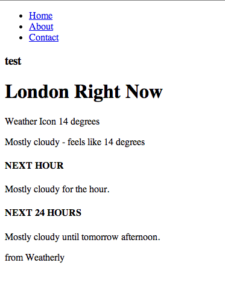

#Writing our first functional test#
_TODO: What is a functional test?

I order to write our first functional test we needed a test page, which we built in the previous section. Now let's set up a simple Node.js webserver. Throughout this section and in future you may find me refering to these kind of tests as Functional Tests, End-to-end, Feature tests or indeed User Journey tests. Confusing I know, I will try my best to keep it to feature and end-to-end tests, but be prepared when discussing this topic to come across the same variety of breadth of names for Functional tests. 

##Web server: Express##
A good practice to follow while working with Git is to create a branch for each feature that you are working on, so let's go ahead and create a new branch for this item of work.
	
	git checkout -b web-server
	
Make sure you are in the root of our project and not in the `app/` folder

Since we'll be using Node.js we can use NPM to manage the dependencies. These dependencies are stored in a folder called node_modules. Since we don't want to check any node modules/packages into our repository we added that folder to our `.gitignore` file in when we set up the project. If we don't add those packages to our repository you may be wondering how our CI and Heroku instance will now how to run the app. To that end we'll use a handy file called `package.json`. When we run NPM we can not only install dependencies, we can also add them to our `package.json` file and our target envinronments can read this file and install these packages for us.

Typing `npm init` give us a way to create our package.json, here's what I answered when prompted:

	This utility will walk you through creating a package.json file.
	It only covers the most common items, and tries to guess sane defaults.

	See `npm help json` for definitive documentation on these fields
	and exactly what they do.

	Use `npm install <pkg> --save` afterwards to install a package and
	save it as a dependency in the package.json file.

	Press ^C at any time to quit.
	name: (weatherly) 
	version: (0.0.0) 
	description: Building a web app guided by tests
	entry point: (index.js) 
	test command: grunt test
	git repository: (https://github.com/gregstewart/weatherly.git) 
	keywords: 
	author: Greg Stewart
	license: (ISC) MIT
	About to write to /Users/gregstewart/Projects/github/weatherly/package.json:

	{
  		"name": "weatherly",
  		"version": "0.0.0",
  		"description": "Building a web app guided by tests",
  		"main": "index.js",
  		"scripts": {
    		"test": "grunt test"
  		},
  		"repository": {
    		"type": "git",
    		"url": "https://github.com/gregstewart/weatherly.git"
  		},
  		"author": "Greg Stewart",
  		"license": "MIT",
  		"bugs": {
    		"url": "https://github.com/gregstewart/weatherly/issues"
  		},
	  	"homepage": "https://github.com/gregstewart/weatherly"
	}
	
	Is this ok? (yes) yes

As you can see it autocompleted a bunch of information for you, such as the project name, version number and Git details. Let's add that file to our repo before going any further:

	git add package.json
	git commit -m "Created package.json file"

Now let's go ahead and install a web server module. We'll just use [express](http://expressjs.com/).

	npm install express --save
	
By specifying `--save` the dependecy was added to our `package.json` file, if you open it up you should see the following toward the end of the file:

	"dependencies": {
   		"express": "^4.4.5"
  	}

Next create a new file called `server.js` in the root of our project and add the following content:

	var express = require('express');
	var app = express();

	app.use(express.static(__dirname + '/app'));

	var server = app.listen(3000, function() {
	  console.log('Listening on port %d', server.address().port);
	});

And to start our server type:

	npm start

If you now open your browser and hit `http://localhost:3000` you should once again see: 

The process that runs our server is not daemonised and will continue to run until we close the console or type `^C`. Go ahead and kill the server and add those changes to our repository, merge these changes back into master and finally push to origin:

	git add server.js
	git add package.json
	git commit -m "Installed Connect and created a very basic web server for our app"
	git checkout master
	git merge web-server
	git push
	
##Cucumber, WebDriver and Selenium##
For our functional tests I have chosen [Cucumber.js](https://github.com/cucumber/cucumber-js) and [WebDriver.js](http://webdriver.io/) with [Selenium](http://docs.seleniumhq.org/). I chose this combination because I believe this will give you greater felxibility in the long wrong, especially if you plan on using different languagesin your toolchain. You can find Ruby, Java and .Net versions of Cucumber, WebDriver and Selenium.

Once again we'll create a dedicated branch for this work:

	git checkout -b functional-test

###Selenium##

> Selenium uses Java, so you will need to make sure you have it installed.

We could install the binaries manually, but since I plan using Grunt to automate tasks around starting and stopping the server, we might as well use [grunt-selenium-webdriver] (https://www.npmjs.org/package/grunt-selenium-webdriver) module as this includes everything that we need, including the jar file for the Selenium Server. 

	`npm install grunt-selenium-webdriver --save-dev`
	
We use the `--save-dev` flag to indicate that we want to add this dependency to our package.json file, however only for development purposes. With that done let's create a Grunt task to start the server (you can find more information on Grunt and tasks over at [the official Grunt.js website](http://gruntjs.com/getting-started)). The first thing we'll need is a `Gruntfile.js`, so add one to the root of your project and edit it to contain the following:

	module.exports = function(grunt) {
  		grunt.initConfig({
  		});

  		grunt.loadNpmTasks('grunt-selenium-webdriver');

  		grunt.registerTask('e2e', [
    		'selenium_start',
    		'selenium_stop'
  		]);
	};

Save the changes and at the command line type: `grunt e2e` and you should see something like this: 

	Running "selenium_start" task
	seleniumrc webdriver ready on 127.0.0.1:4444

	Running "selenium_stop" task

	Done, without errors.
	
This told grunt to execite a task called `e2e` and confirms that the selenium server started properly at the following address `127.0.0.1:4444` and then was shutdown again (apparently it is not necessary to shutdown the server with a stop task).

###Using Grunt to start and stop the server###
Let's also add a step to stop and start our web server when we are running our frunctional tests. To that end we'll install another grunt module:

	npm install grunt-express-server --save-dev

And we'll edit our Grunt file so that it looks for our `server.js` and we can control the starting and stopping of our server:

	module.exports = function(grunt) {
  		grunt.initConfig({
    		express: {
      			test: {
        			options: {
          				script: './server.js'
        			}
      			}
    		}
  		});

  		grunt.loadNpmTasks('grunt-express-server');
  		grunt.loadNpmTasks('grunt-selenium-webdriver');

  		grunt.registerTask('e2e', [
    		'selenium_start',
    		'express:test',
    		'selenium_stop',
    		'express:test:stop'
  		]);
	};
	
If you now run `grunt e2e`, you should see the following output:

	Running "selenium_start" task
	seleniumrc webdriver ready on 127.0.0.1:4444

	Running "express:test" (express) task
	Starting background Express server
	Listening on port 3000

	Running "selenium_stop" task

	Running "express:test:stop" (express) task

###WebDriver###
The next thing we need to do is install [WebDriver.js](http://webdriver.io/) and we are then nearly ready to write our first feature test:

	npm install webdriverjs --save-dev

###Cucumber###
The final piece of the puzzle is [Cucumber.js](https://github.com/cucumber/cucumber-js):
	
	npm install cucumber --save-dev

##Our first test##

Features are written using the [Gherkin syntax](https://github.com/cucumber/cucumber/wiki/Gherkin), and this is what our first feature looks like:

	Feature: Using our awesome weather app
		As a user of weatherly
 		I should be able to see the weather information for my location
	
		Scenario: Viewing the homepage
    		Given I am on the home page
    		When I view the main content area
    		Then I should see the temperature for my location

I like to store these and the associated code in a e2e directory under a parent tests folder. So go ahead and create that folder structure under the root of our project. Then create a features folder and save the above feature contents to a file called `using-weatherly.feature`.

If we were to run our cucumber tests now using `cucumber.js tests/e2e/features/using-weatherly.feature` we would see the following output:

	UUU

	1 scenario (1 undefined)
	3 steps (3 undefined)

	You can implement step definitions for undefined steps with these snippets:

	this.Given(/^I am on the home page$/, function (callback) {
  		// express the regexp above with the code you wish you had
  		callback.pending();
	});

	this.When(/^I view the main content area$/, function (callback) {
  		// express the regexp above with the code you wish you had
  		callback.pending();
	});

	this.Then(/^I should see the temperature for my location$/, function (callback) {
  		// express the regexp above with the code you wish you had
  		callback.pending();
	});

This is extremely useful output. While it's clear that the code to execute the steps in the feature are undefined, the output actually gives snippets to create our step definitions. So let's go ahead and create our step definition. Inside of our functional test folder, create a `steps` folder and add a file called `using-weather-steps.js` with the following content:

	var UsingWeatherlyStepDefinitions = function () {

    	this.Given(/^I am on the home page$/, function (callback) {
      		// express the regexp above with the code you wish you had
      		callback.pending();
    	});

    	this.When(/^I view the main content area$/, function (callback) {
      		// express the regexp above with the code you wish you had
      		callback.pending();
    	});
    
    	this.Then(/^I should see the temperature for my location$/, function (callback) {
      		// express the regexp above with the code you wish you had
      		callback.pending();
    	});       
	};

	module.exports = UsingWeatherlyStepDefinitions;
	
Let's try and execute our feature test again with `cucumber.js tests/e2e/features/using-weatherly.feature --require tests/e2e/steps/using-weatherly-step-definitions.js` and now we should see:

	P--

	1 scenario (1 pending)
	3 steps (1 pending, 2 skipped)

Time to flesh out the steps to do some work and check for elements on the page while the tests are running. We'll make use of [Chai.js](http://chaijs.com/) as our assertion library, so let's go ahead and install this module:

	npm install chai --save-dev

The first bit of code we'll add to our tests is a [World object](https://github.com/cucumber/cucumber-js#world), which willl initialise our browser (read WebDriver) and add a few helper methods (`visit` and `hasText`). As our browser we are using phantomjs, but if you would like to see the test running simply replace `browserName: 'phantomjs'` with say `browserName: 'firefox'`.

> Note that other browsers such as Chrome and IE require special drivers which you can download from the [Selenium website](http://docs.seleniumhq.org/)

Here's our world object (`world.js`), which we save into a folder called support under `tests/e2e`:

	var webdriverjs = require('webdriverjs');
	var expect = require('chai').expect;
	var assert = require('chai').assert;

	var client = webdriverjs.remote({ desiredCapabilities: {browserName: 'phantomjs'}, logLevel: 'silent' });

	client.addCommand('hasText', function (selector, text, callback) {
  		this.getText(selector, function (error, result) {
    		expect(result).to.have.string(text);
    		callback();
  		});
	});

	client.init();

	var World = function World(callback) {
  		this.browser = client;

  		this.visit = function(url, callback) {
    		this.browser.url(url, callback);
  		};

  		callback(); // tell Cucumber we're finished and to use 'this' as the world instance
	};

	exports.World = World;

Please note that if when running the tests you come across the message shown below (logging in verbose mode here), this simply (indeed simply...) means that webdriverjs cannot find phatomjs in your PATH.

	====================================================================================
	Selenium 2.0/webdriver protocol bindings implementation with helper commands in nodejs.
	For a complete list of commands, visit http://webdriver.io/docs.html.

	====================================================================================

	[09:51:45]:  ERROR      Couldn't get a session ID - undefined
	Fatal error: [init()] <=
	An unknown server-side error occurred while processing the command.

Now let's re-visit our `using-weatherly-step-definitions.js` and replace the contents with the following code:

	var UsingWeatherlyStepDefinitions = function () {
    	this.World = require("../support/world.js").World;

	    this.Given(/^I am on the home page$/, function (callback) {
      		this.visit('http://localhost:3000/', callback);
    	});

    	this.When(/^I view the main content area$/, function (callback) {
      		this.browser.hasText('.jumbotron h1', 'London Right Now', callback);
    	});

    	this.Then(/^I should see the temperature for my location$/, function (callback) {
      		this.browser.hasText('p.temperature', '14 degrees', callback);
    	});
	};

	module.exports = UsingWeatherlyStepDefinitions;

The first step opens the site, and then we assert that the header element displays `London Right Now` and that the element with our temperature shows `14 degrees`

If we were to once again try and execute our feature test, we would get an error telling us that it can't connect to the selenium server. So let's wrap all of this into our e2e grunt task. Let's start by adding another module to our setup:
	
	npm install grunt-cucumber --save-dev

And let's edit our `Gruntfile.js` to look like this now:

	module.exports = function(grunt) {
  		grunt.initConfig({
    		express: {
      			test: {
        			options: {
          				script: './server.js'
        			}
      			}
    		},
    		cucumberjs: {
      			src: 'tests/e2e/features/',
      			options: {
        			steps: 'tests/e2e/steps/'
      			}
    		}
  		});

  		grunt.loadNpmTasks('grunt-express-server');
  		grunt.loadNpmTasks('grunt-selenium-webdriver');
  		grunt.loadNpmTasks('grunt-cucumber');

  		grunt.registerTask('e2e', [
    		'selenium_start',
    		'express:test',
    		'cucumberjs',
    		'selenium_stop',
    		'express:test:stop'
  		]);
	};

Now type `grunt e2e` and you should see the following output:

	Running "selenium_start" task
	seleniumrc webdriver ready on 127.0.0.1:4444

	Running "express:test" (express) task
	Starting background Express server
	Listening on port 3000

	Running "cucumberjs:src" (cucumberjs) task
	...

	1 scenario (1 passed)
	3 steps (3 passed)

	Running "selenium_stop" task

	Running "express:test:stop" (express) task
	Stopping Express server

	Done, without errors.
	
With that done we can commit our changes to our repository:

	git add .
	git commit -m "Scenario: Viewing the homepage, created and implemented"
	git checkout master
	git merge functional-test
	git push

##Recap##
To sum things up in this section we created a set of grunt tasks that:

* start our selenium server
* start our express server that hosts our page
* execute the features and steps we defined with cucumberjs
* output the result to the console
* closes down the services after finishing the tests

We also wrote a feature test that:

* open a browser
* check the contents for a header
* check for an element that holds the current temperature