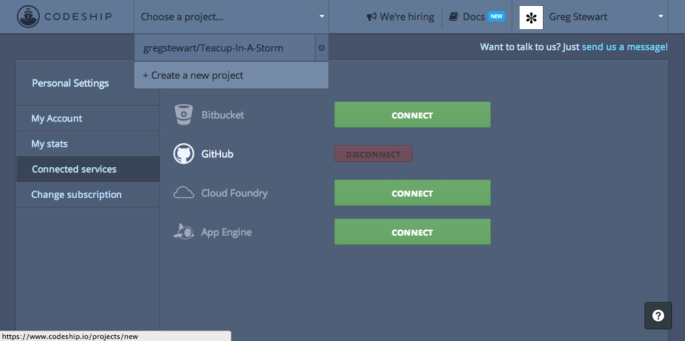
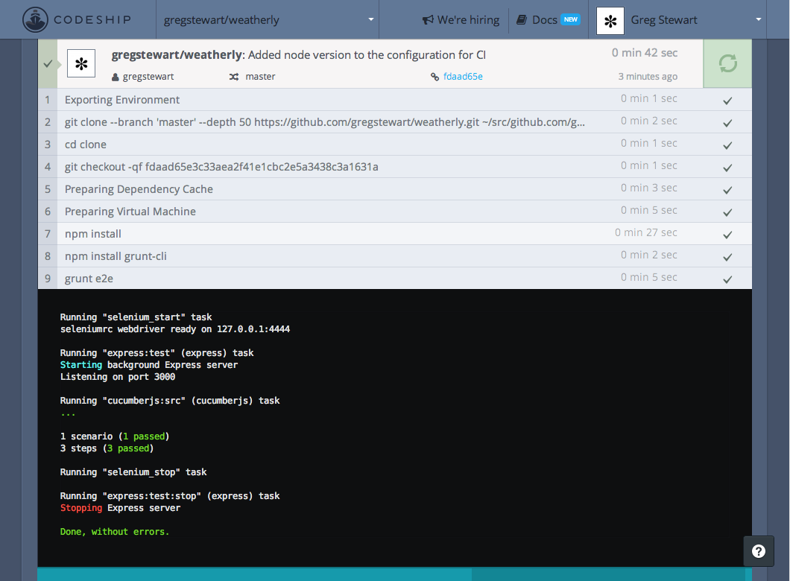
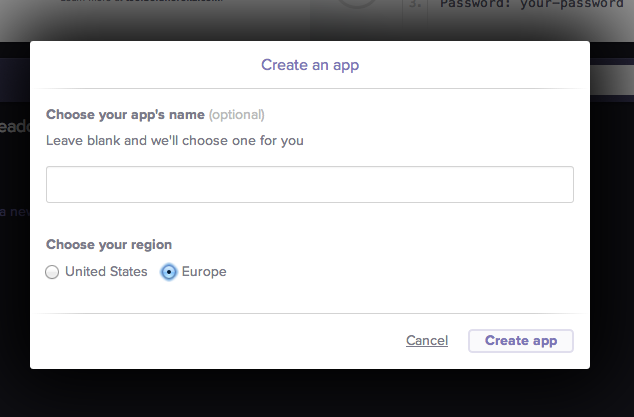
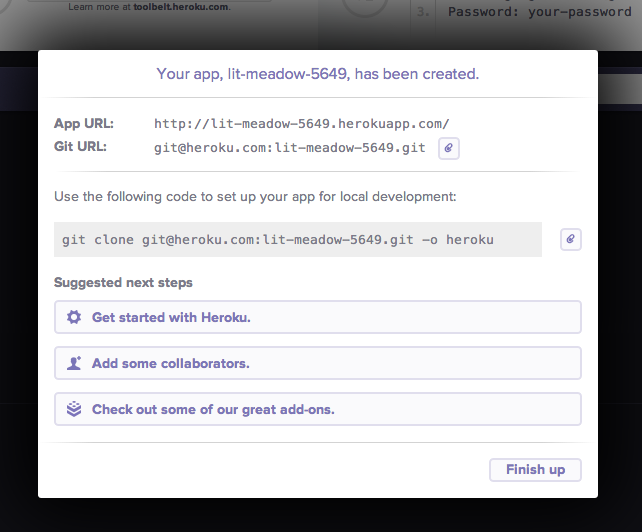

#Continuous delivery#
In the previous part we wrote our first functional test (or feature test or end 2 end test) and automated the running using a set of Grunt tasks. Now we will put these tasks to good use and have our Continuous Integration server run the test with each commit to our remote repository. There are two parts two Continuous Delivery: Continuous Integration and Continuous Deployment. These two best practices were best defined [in the blog post over at Treehouse](http://blog.teamtreehouse.com/use-continuous-integration-continuous-deployment), do read the article, but here's the tl;rd:

>**Continuous Integration** is the practice of testing each change done to your codebase automatically and as early as possible. But this paves the way for the more important process: Continuous Deployment.

>**Continuous Deployment** follows your tests to push your changes to either a staging or production system. This makes sure a version of your code is always accessible.

In this ection we'll focus on Continuous Integration. As always before starting we'll create a dedicated branch for our work:

	git checkout -b ci

##Setting up our Continuous Integration environment using Codeship##
In the what you will need section I suggested signing up for a few services, if you haven't by now created an account with either [Github](https://github.com/) and [Codeship](https://www.codeship.io/) now is the time! Also if you haven't already now is the time to connect your Githuib account with Codeship. You can do this by looking under your account settings for connected services:

 

To get started we need to create a new project:

 

This starts starts a three step process:

1. Connect to your source code provider
2. Choose your repository 
3. Setup test commands

The first step is easy, choose the Github option, then for step two choose the `weatherly` repository from the list.

>If you hadn't already signed up for Github and hadn't pushed your changes to it, then the repository won't be showing up in the list. Link your local repository and [push all changes up](https://help.github.com/articles/pushing-to-a-remote) before continuing.

Not it's time to set up the third step, set up out test commands. From the drop down labelled `Select your technology to prepopulate basic commands` choose `node.js`. 

Next we need to tackle the section: `Modify your Setup Commands`. The instructions tell us that it can use the Node.js version specified in our `package.json` file, given that we have not added this information previously let's go ahead and do that now. If you are unsure of the version of Node.js simply type:

	node --version

In my case the output was **0.10.28**, below is my package.json file, look for the block labelled with **engines**:

	{
  		"name": "weatherly",
  		"version": "0.0.0",
  		"description": "Building a web app guided by tests",
  		"main": "index.js",
  		"engines" : {
    		"node" : "~0.10.28"
  		},
  		"scripts": {
    		"test": "grunt test"
  		},
  		"repository": {
    		"type": "git",
    		"url": "https://github.com/gregstewart/weatherly.git"
  		},
  		"author": "Greg Stewart",
  		"license": "MIT",
  		"bugs": {
    		"url": "https://github.com/gregstewart/weatherly/issues"
  		},
  		"homepage": "https://github.com/gregstewart/weatherly",
  		"dependencies": {
    		"express": "^4.4.5"
  		},
  		"devDependencies": {
    		"chai": "^1.9.1",
    		"cucumber": "^0.4.0",
    		"grunt": "^0.4.5",
    		"grunt-cucumber": "^0.2.3",
    		"grunt-express-server": "^0.4.17",
    		"grunt-selenium-webdriver": "^0.2.420",
    		"webdriverjs": "^1.7.1"
  		}
	}

With that added we can edit the set up commands to look as follows:

	npm install
	npm install grunt-cli

Now let's edit the `Modify your Test Commands` section. In the previous chapter we created a set of tasks to run our tests and wrapped them in a grunt command `grunt e2e`. Let's add this command to our configuration:

	grunt e2e

That's hit the big save button. Right now we are ready to push some changes to our repository. Luckily we have a configuration change ready to push!

	git add package.json
	git commit -m "Added node version to the configuration for CI"
	git checkout master
	git merge ci
	git push
	
And with that go over to your codeship dashboard and if it all went well, then you should see something like this:

 
	
You have to admit that setting this up was a breeze. Now we are ready to configure our Continous Deployment to Heroku.

##Setting up Continous Deployment to Heroku##
Before we configure our CI server to to deploy our code to Heroku on a successful build, we'll need to create a new app through our Heroku dashboard:

 

And click on the `Create a new app` link and complete the dialogue box.

 

The name weatherly was already taken so I left it blank to get one assigned, if you do this as well, just be sure to make a note of it as we'll need it shortly. I choose Europe, well because I live in Europe, so feel free to choose what ever region makes sense to you.

Armed with this information let's head back to our project on Codeship and let's configure our deployment. From the project settings choose the Deployment tab and from the targets select Heroku. You will need your Heroku app name (see above) and your Heroku api key which you can find under your account settings under the Heroku dashboard:

We will be deploying from our `master` branch. Once you are happy with your settings click on the little green tick icon to save the information. Time to test our set up! We just need to make one little change to our app configuration which is handy because that will allow us to commit and a change and verify the whole process from start to finish. In the previous section we have configured our web server to listen on port 3000, well Heroku assigns a part dynamically, so we to account for that by editing our server.js file by adding `process.env.PORT` to our listen function:

	var express = require('express');
	var app = express();

	app.use(express.static(__dirname + '/app'));

	var server = app.listen(process.env.PORT || 3000, function() {
  		console.log('Listening on port %d', server.address().port);
	});

Now let's commit the change:

	git add server.js
	git commit -m "Server configured to handle dynamic port allocation"
	git push
	
If we check our build dashboard we should see a succesful build and deployment to our Heroku instance:

The build process checks that we get a 200 response back and marks the build as successful, so let's [open up our browser](http://lit-meadow-5649.herokuapp.com/) to see the results of our work:

And there you are your Continuous Delivery pipeline has been created and in less than a minute we go from commit to production!

##Recap##
In this last section we:

* configued our ci envinronment
* it runs our feature test
* created a Heroku app
* configured our CI environment to deploy to that instance
* modified our web server to handle dynamic port allocation

