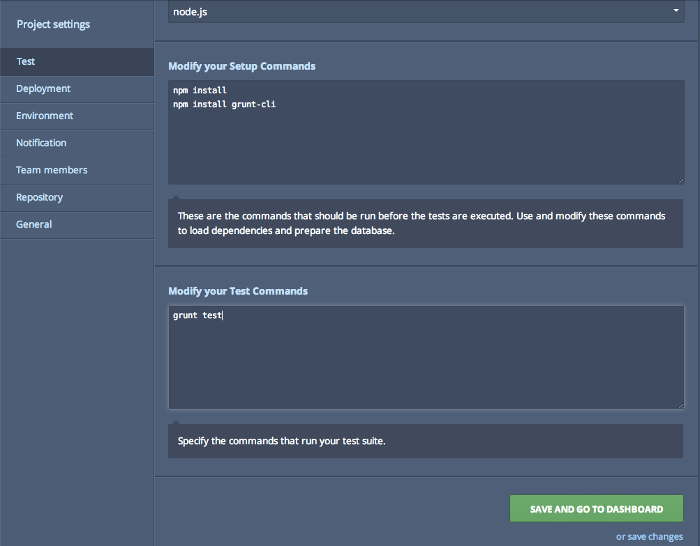
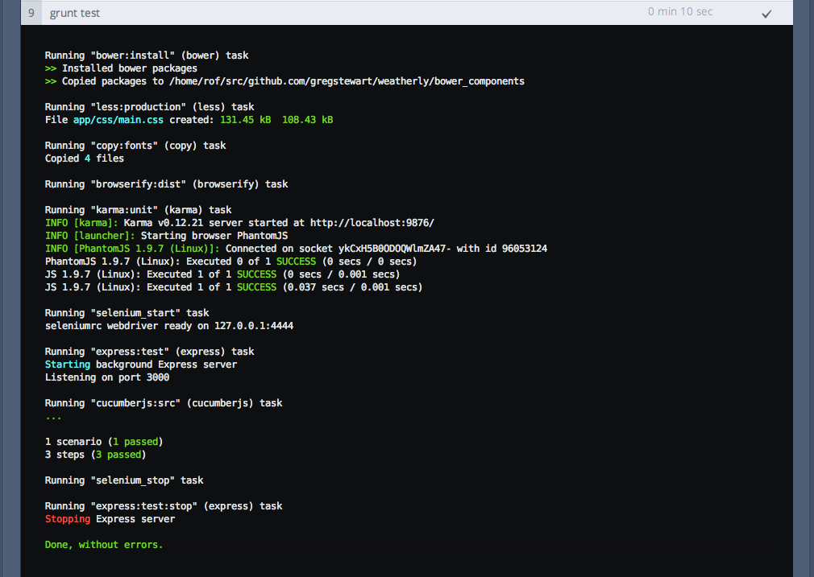

#Development guided by tests#
Up until now we have been very much focused on setting up our build pipeline and writing a high level feature tests. And while I promised that it was time to write some code, we do have do a few more setup steps before we can get stuck in. To get confidence in our code we will be writing JavaScript modules using tests and we want those tests to run all the time (i.e. with each save). To that end we need to set up some more tasks to run those tests for us and add them to our our deployment process. Furthermore we want these test to run during our build process.

##Setting up our unit test runner using karma##
I have chosen [Karma](https://www.npmjs.org/package/karma) as our Unit test runner, if you are new to [Karma](http://karma-runner.github.io/) I suggest you take a peak at some of the videos on the site. It comes with a variety of plugins and supports basically all of the popular unit test frameworks. As our testing framework we will use Jasmine.

Before going to far, let's quickly create a few folders in the root of our project. `src/js` is where we will store all of our JavaScript source code, later on we will create a task to concatenate/minify and move it to our app folder:

	-> tests
		-> unit
	-> src
		->js
		
_TODO: this for now but really I want to do commonJS_		

As with all tasks, let's create a new branch:

	> git checkout -b test-runner
	
And then let's install the package and add it to our package.json file:

	> npm install karma --save-dev
	
Ok time to create our Karma configuration file, typically you would type in the root of your project:

	> karma init karma.conf.js

This would guide you through the process of setting up your test runner, here's how I answered the setup questions:

	Which testing framework do you want to use ?
	Press tab to list possible options. Enter to move to the next question.
	> jasmine

	Do you want to use Require.js ?
	This will add Require.js plugin.
	Press tab to list possible options. Enter to move to the next question.
	> no

	Do you want to capture any browsers automatically ?
	Press tab to list possible options. Enter empty string to move to the next question.
	> PhantomJS
	> 

	What is the location of your source and test files ?
	You can use glob patterns, eg. "js/*.js" or "test/**/*Spec.js".
	Enter empty string to move to the next question.
	> src/js/**/*.js
	WARN [init]: There is no file matching this pattern.

	> tests/unit/**/*.js
	WARN [init]: There is no file matching this pattern.

	> 

	Should any of the files included by the previous patterns be excluded ?
	You can use glob patterns, eg. "**/*.swp".
	Enter empty string to move to the next question.
	> 

	Do you want Karma to watch all the files and run the tests on change ?
	Press tab to list possible options.
	> no

	Config file generated at "/Users/writer/Projects/github/weatherly/karma.conf.js".

And here's the corresponding configuration that was generated:

    // Karma configuration
    // Generated on Sun Jul 20 2014 16:18:54 GMT+0100 (BST)
    
    module.exports = function (config) {
        config.set({
    
            // base path that will be used to resolve all patterns (eg. files, exclude)
            basePath: '',
    
    
            // frameworks to use
            // available frameworks: https://npmjs.org/browse/keyword/karma-adapter
            frameworks: ['jasmine'],
    
    
            // list of files / patterns to load in the browser
            files: [
                'src/js/**/*.js',
                'tests/unit/**/*.js'
            ],
    
    
            // list of files to exclude
            exclude: [
            ],
    
    
            // preprocess matching files before serving them to the browser
            // available preprocessors: https://npmjs.org/browse/keyword/karma-preprocessor
            preprocessors: {
            },
    
    
            // test results reporter to use
            // possible values: 'dots', 'progress'
            // available reporters: https://npmjs.org/browse/keyword/karma-reporter
            reporters: ['progress'],
    
    
            // web server port
            port: 9876,
    
    
            // enable / disable colors in the output (reporters and logs)
            colors: true,
    
    
            // level of logging
            // possible values: config.LOG_DISABLE || config.LOG_ERROR || config.LOG_WARN || config.LOG_INFO || config.LOG_DEBUG
            logLevel: config.LOG_INFO,
    
    
            // enable / disable watching file and executing tests whenever any file changes
            autoWatch: true,
    
    
            // start these browsers
            // available browser launchers: https://npmjs.org/browse/keyword/karma-launcher
            browsers: ['PhantomJS'],
    
    
            // Continuous Integration mode
            // if true, Karma captures browsers, runs the tests and exits
            singleRun: true
        });
    };

Let's take it for a spin:

	> karma start
	INFO [karma]: Karma v0.12.17 server started at http://localhost:9876/
	INFO [launcher]: Starting browser PhantomJS
	WARN [watcher]: Pattern "/Users/writer/Projects/github/weatherly/tests/unit/**/*.js" does not match any file.
	INFO [PhantomJS 1.9.7 (Mac OS X)]: Connected on socket iqriF61DkEH0qp-sXlwR with id 10962078
	PhantomJS 1.9.7 (Mac OS X): Executed 0 of 0 ERROR (0.003 secs / 0 secs)

So we got an error, but that is because we have no tests. Let's wrap this into a grunt task:

	> npm install grunt-karma --save-dev

And update our Gruntfile to load the task:

	module.exports = function (grunt) {
        grunt.initConfig({
            express: {
                test: {
                    options: {
                        script: './server.js'
                    }
                }
            },
            cucumberjs: {
                src: 'tests/e2e/features/',
                options: {
                    steps: 'tests/e2e/steps/'
                }
            },
            karma: {
                unit: {
                    configFile: 'karma.conf.js'
                }
            }
        });

        grunt.loadNpmTasks('grunt-express-server');
        grunt.loadNpmTasks('grunt-selenium-webdriver');
        grunt.loadNpmTasks('grunt-cucumber');
        grunt.loadNpmTasks('grunt-karma');

        grunt.registerTask('e2e', [
            'selenium_start',
            'express:test',
            'cucumberjs',
            'selenium_stop',
            'express:test:stop'
        ]);
    };

Let's try this out our new grunt task:
    
	> grunt karma:unit
	
	> Running "karma:unit" (karma) task
	> INFO [karma]: Karma v0.12.17 server started at http://localhost:9876/
	> INFO [launcher]: Starting browser PhantomJS
	> WARN [watcher]: Pattern "/Users/gregstewart/Projects/github/weatherly/src/js/**/*.js" does not match any file.
	> WARN [watcher]: Pattern "/Users/gregstewart/Projects/github/weatherly/tests/unit/**/*.js" does not match any file.
	> INFO [PhantomJS 1.9.7 (Mac OS X)]: Connected on socket QO4qLCSO-4DZVO7eaRky with id 9893379
	> PhantomJS 1.9.7 (Mac OS X): Executed 0 of 0 ERROR (0.003 secs / 0 secs)
	> Warning: Task "karma:unit" failed. Use --force to continue.

	> Aborted due to warnings.

Similar output, with the difference that our process terminated this time because of the warnings about no files macthing our pattern. We'll fix this issue by writing our very first unit test!

##Writing and running our first unit test 
In the [previous chapter](link here) we created a source folder and added a sample module, to confirm our build process for our JavaScript assets worked. Let's go ahead and create one test file, as well as some of the folder structure for our project: 

	> mkdir tests/unit/
	> mkdir tests/unit/model/
	> touch tests/unit/model/TodaysWeather-spec.js

What we want to do know is validate our Karma configuration before we starting our real tests, so let's add a sample test to our `TodaysWeather-spec.js`:

	describe('Today \'s weather', function () {
    	it('should return 2', function () {
       		expect(1+1).toBe(2);
    	});
	});

We could try and run our Karma task again, but this would only result in an error, because we are using the [CommonJS](http://wiki.commonjs.org/wiki/CommonJS) module approach and we would see an error stating that `module` is not defined, because our module under tests uses:

	module.exports = TodaysWeather;
	
In order to fix this we need run our `browserify` task before our `karma` task, so let's register a new task `unit` in our grunt file to handle this:

    module.exports = function (grunt) {
        grunt.initConfig({
            express: {
                test: {
                    options: {
                        script: './server.js'
                    }
                }
            },
            cucumberjs: {
                src: 'tests/e2e/features/',
                options: {
                    steps: 'tests/e2e/steps/'
                }
            },
            less: {
                production: {
                    options: {
                        paths: ['app/css/'],
                        cleancss: true
                    },
                    files: {
                        'app/css/main.css': 'src/less/main.less'
                    }
                }
            },
            copy: {
                fonts: {
                    expand: true,
                    src: ['bower_components/bootstrap/fonts/*'],
                    dest: 'app/fonts/',
                    filter: 'isFile',
                    flatten: true
                }
            },
            bower: {
                install: {
                    options: {
                        cleanTargetDir:false,
                        targetDir: './bower_components'
                    }
                }
            },
            browserify: {
                dist: {
                    files: {
                        'app/js/main.min.js': ['src/js/**/*.js']
                    }
                },
                options: {
                    transform: ['uglifyify']
                }
            },
            karma: {
                unit: {
                    configFile: 'karma.conf.js'
                }
            }
        });
    
        grunt.loadNpmTasks('grunt-express-server');
        grunt.loadNpmTasks('grunt-selenium-webdriver');
        grunt.loadNpmTasks('grunt-cucumber');
        grunt.loadNpmTasks('grunt-contrib-less');
        grunt.loadNpmTasks('grunt-contrib-copy');
        grunt.loadNpmTasks('grunt-browserify');
        grunt.loadNpmTasks('grunt-bower-task');
        grunt.loadNpmTasks('grunt-karma');
    
        grunt.registerTask('generate', ['less:production', 'copy:fonts', 'browserify']);
        grunt.registerTask('build', ['bower:install', 'generate']);
        grunt.registerTask('unit', ['browserify', 'karma:unit']);
    
        grunt.registerTask('e2e', [
            'selenium_start',
            'express:test',
            'cucumberjs',
            'selenium_stop',
            'express:test:stop'
        ]);
    
        grunt.registerTask('heroku:production', 'build');
    }; 

And modify our `karma.conf.js` to point to the built version of our JavaScript code by updating the files block to point to `app/js/**/*.js` instead of `src/js/**/*.js`.

    // Karma configuration
    // Generated on Sun Jul 20 2014 16:18:54 GMT+0100 (BST)
    
    module.exports = function (config) {
        config.set({
    
            // base path that will be used to resolve all patterns (eg. files, exclude)
            basePath: '',
    
    
            // frameworks to use
            // available frameworks: https://npmjs.org/browse/keyword/karma-adapter
            frameworks: ['jasmine'],
    
    
            // list of files / patterns to load in the browser
            files: [
                'app/js/**/*.js',
                'tests/unit/**/*.js'
            ],
    
    
            // list of files to exclude
            exclude: [
            ],
    
    
            // preprocess matching files before serving them to the browser
            // available preprocessors: https://npmjs.org/browse/keyword/karma-preprocessor
            preprocessors: {
            },
    
    
            // test results reporter to use
            // possible values: 'dots', 'progress'
            // available reporters: https://npmjs.org/browse/keyword/karma-reporter
            reporters: ['progress'],
    
    
            // web server port
            port: 9876,
    
    
            // enable / disable colors in the output (reporters and logs)
            colors: true,
    
    
            // level of logging
            // possible values: config.LOG_DISABLE || config.LOG_ERROR || config.LOG_WARN || config.LOG_INFO || config.LOG_DEBUG
            logLevel: config.LOG_INFO,
    
    
            // enable / disable watching file and executing tests whenever any file changes
            autoWatch: true,
    
    
            // start these browsers
            // available browser launchers: https://npmjs.org/browse/keyword/karma-launcher
            browsers: ['PhantomJS'],
    
    
            // Continuous Integration mode
            // if true, Karma captures browsers, runs the tests and exits
            singleRun: true
        });
    };
 
 Now let's our setup:
 
 	> grunt unit
	> Running "browserify:dist" (browserify) task

	> Running "karma:unit" (karma) task
	> INFO [karma]: Karma v0.12.17 server started at http://localhost:9876/
	> INFO [launcher]: Starting browser PhantomJS
	> INFO [PhantomJS 1.9.7 (Mac OS X)]: Connected on socket 8eDrHt--bJFzVxSN36mN with id 14048651
	> PhantomJS 1.9.7 (Mac OS X): Executed 1 of 1 SUCCESS (0.002 secs / 0.002 secs)

	> Done, without errors.

Perfect!

## Running our tests as part of the build
Now that we have our test runner set up' let's add it to our build process. This is going to require us to register a new task as we will need to do a few things:

* build our assets
* run our unit tests
* run our end to end tests

Let's go ahead and create a task called `test` in our `Gruntfile` and configure it to execute these tasks:

    module.exports = function (grunt) {
        grunt.initConfig({
            express: {
                test: {
                    options: {
                        script: './server.js'
                    }
                }
            },
            cucumberjs: {
                src: 'tests/e2e/features/',
                options: {
                    steps: 'tests/e2e/steps/'
                }
            },
            less: {
                production: {
                    options: {
                        paths: ['app/css/'],
                        cleancss: true
                    },
                    files: {
                        'app/css/main.css': 'src/less/main.less'
                    }
                }
            },
            copy: {
                fonts: {
                    expand: true,
                    src: ['bower_components/bootstrap/fonts/*'],
                    dest: 'app/fonts/',
                    filter: 'isFile',
                    flatten: true
                }
            },
            bower: {
                install: {
                    options: {
                        cleanTargetDir:false,
                        targetDir: './bower_components'
                    }
                }
            },
            browserify: {
                dist: {
                    files: {
                        'app/js/main.min.js': ['src/js/**/*.js']
                    }
                },
                options: {
                    transform: ['uglifyify']
                }
            },
            karma: {
                unit: {
                    configFile: 'karma.conf.js'
                }
            }
        });
    
        grunt.loadNpmTasks('grunt-express-server');
        grunt.loadNpmTasks('grunt-selenium-webdriver');
        grunt.loadNpmTasks('grunt-cucumber');
        grunt.loadNpmTasks('grunt-contrib-less');
        grunt.loadNpmTasks('grunt-contrib-copy');
        grunt.loadNpmTasks('grunt-browserify');
        grunt.loadNpmTasks('grunt-bower-task');
        grunt.loadNpmTasks('grunt-karma');
    
        grunt.registerTask('generate', ['less:production', 'copy:fonts', 'browserify']);
        grunt.registerTask('build', ['bower:install', 'generate']);
        grunt.registerTask('unit', ['browserify', 'karma:unit']);
    
        grunt.registerTask('e2e', [
            'selenium_start',
            'express:test',
            'cucumberjs',
            'selenium_stop',
            'express:test:stop'
        ]);
    
        grunt.registerTask('test', ['build', 'karma:unit', 'e2e']);
    
        grunt.registerTask('heroku:production', 'build');
    };
    
And let's make sure everything runs as intended:

	> grunt test
	> Running "less:production" (less) task
	> File app/css/main.css created: 131.45 kB → 108.43 kB

	> Running "copy:fonts" (copy) task
	> Copied 4 files

	> Running "browserify:dist" (browserify) task

	> Running "karma:unit" (karma) task
	> INFO [karma]: Karma v0.12.17 server started at http://localhost:9876/
	> INFO [launcher]: Starting browser PhantomJS
	> INFO [PhantomJS 1.9.7 (Mac OS X)]: Connected on socket 1kikUD-UC4_Gd6Qh9T49 with id 53180162
	> PhantomJS 1.9.7 (Mac OS X): Executed 1 of 1 SUCCESS (0.002 secs / 0.002 secs)

	> Running "selenium_start" task
	> seleniumrc webdriver ready on 127.0.0.1:4444

	> Running "express:test" (express) task
	> Starting background Express server
	> Listening on port 3000

	> Running "cucumberjs:src" (cucumberjs) task
	> ...

	> 1 scenario (1 passed)
	> 3 steps (3 passed)

	> Running "selenium_stop" task

	> Running "express:test:stop" (express) task
	> Stopping Express server

	> Done, without errors.

If you recall we configured our build to execute `grunt e2e`, we need to update this now to execute `grunt test`. Log into to your Codeship dashboard and edit the test configuration:

Ready to give this is a spin? 

 > git status
 > git add .
 > git commit -m "Karma test configuration added and new build test task created"
 > git checkout master
 > git merge test-runner
 > git push
 
If we keep an eye on our dashboard we should see a build kicked-off and `test` task being executed:

 

## Continuoulsy running our tests
* continuously run unit tests with grunt
 
## Adding code coverage
 * code coverage
 
 
 * integration test
 * using stubs
 * using mocks